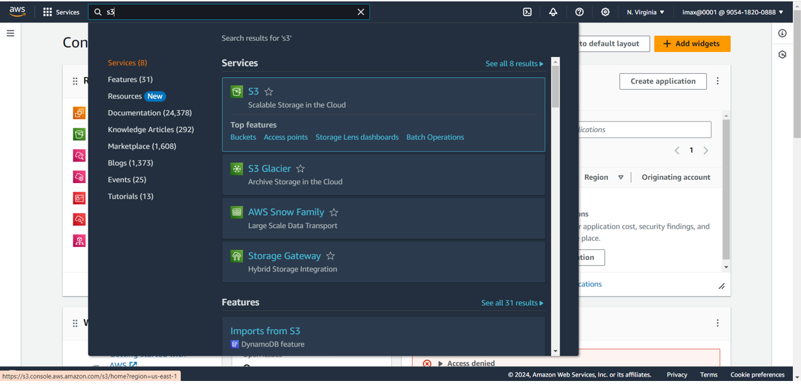
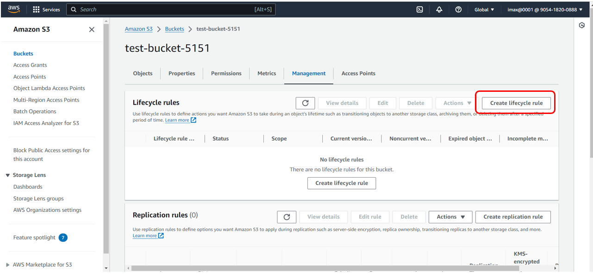
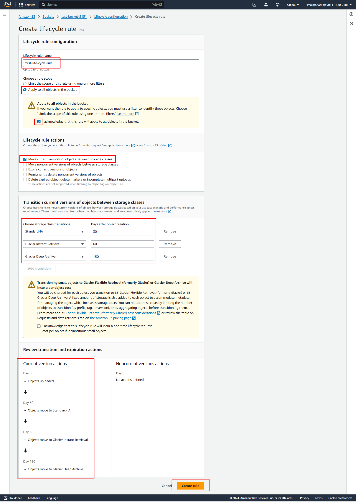
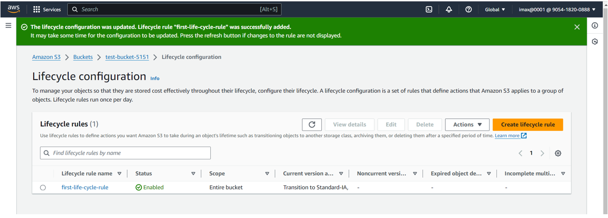

# Lifecycle Management(AWS-S3Bucket)

**1. follow `S3Bucket(AWS-CLI).md` file to Create S3 Bucket**
**, After that go to S3 page and click on bucket name**

**2. Click on `Create lifecycle rule`**

**3. In Create lifecycle rule page:**
- Enter meaningful name of Lifecycle rule
-Choose a rule scope: Apply to all objects in bucket
- click on acknowledge checkbox
- select Lifecycle rule action: Move current versions of objects between storage classes
- In Transition current versions of objects between storage classes Add transition like: 
  Standard-IA = 30days
  Glacier Instant Retrieval = 60days
  Glacier Deep Archive = 150 days
- After that Review transition and expiration action and click on`Create rule` button.

**4. We can see in Lifecycle Configuration page `Lifecycle rule` is create successfully**

**5. This rule is associated to our S3 bucket, Whatever objects present in S3 bucket will follow this lifecycle rule**

**Also we can minimize the cost by using Lifecycle management rule**